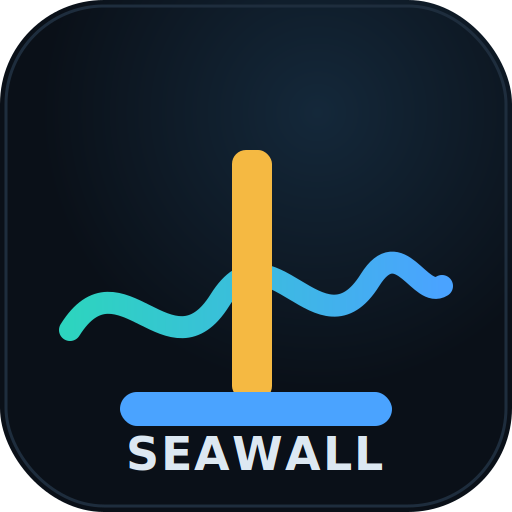

<p align="center"></p>

# Seawall — Autonomous Risk Guardian for Sui lending

**A trust-minimized, autonomous circuit breaker.** An off-chain ML agent watches
multiple price sources + the DeepBook order book and proposes *safer-only*
parameter changes; an on-chain Move policy object **re-derives the breach itself
from raw Pyth + DeepBook** before it acts, and can only ever move the protocol
toward safer — its number is never trusted. It fills the gap between NAVI's
stateless per-op check and today's manual, hours-late freezes.

> **Sui Overflow 2026 — Agentic Web / Sub-track 1 (Autonomous Risk Guardian).**
> The last guardian of the Aave wstETH mis-liquidation was a *trusted* off-chain
> agent, and it failed. Ours can't: the contract confirms every breach from
> on-chain data, the agent can only push *safer*, and only the DAO unfreezes.

## Why it's trust-minimized (the make-or-break)

The agent is an **untrusted early-warning radar**, not an authority:

- **The contract re-derives the breach on-chain**, in the *same PTB* as the agent's
  fresh Pyth post: it reads `get_price_no_older_than` **and** the DeepBook level-2
  book itself, computes the Pyth↔CLOB divergence, and acts on *that* — never on the
  agent's word. `EWrongFeed` / `EWrongPool` asserts pin both sources.
- **One-way ratchet.** The agent's `ParamRequest` can only tighten, bounded to a
  DAO-set corridor `[floor, baseline]`. A looser ask is rejected; an over-tight or
  malicious ask is clamped to the floor and logged (`RequestClamped`/`RequestRejected`).
  The advisory 0–100 score is an **event field only** — never on the logic path.
- **FREEZE is contract-only.** A hard stop fires purely on the contract's own
  measured divergence `≥ T` (or an unusable book). The agent has no freeze input.
- **Only the owned `&GovernanceCap` unfreezes / loosens.** The agent can't hold it;
  a shared-object call can't bypass it.

## Architecture

| Piece | What it does |
|---|---|
| `guardian` Move package | `GuardianPolicy` (shared) re-derives Pyth↔DeepBook divergence on-chain + the 3-layer enforcement; `GovernanceCap` (owned) = DAO override |
| `demo_vault` | the demo consumer — a live Pyth-priced SUI position whose inline floor calls the SAME params-less `poke` on every borrow/withdraw |
| `@seawall/agent` | off-chain EWMA-Mahalanobis anomaly detector → calibrated score + `ParamRequest`; one same-PTB `submit` when it would tighten |
| `@seawall/keeper` | permissionless params-less `poke` every 5 min (freeze/relax/liveness, ML-independent) |
| `@seawall/dashboard` | Vite + React: live gauge, model internals, on-chain action log, DAO override, attack panel |

**3-layer enforcement** on one divergence signal — *trust decides who pulls which rung*:
1. **Inline floor** — the vault's per-borrow self-check (always-on, agent-independent loss-preventer).
2. **CAUTION** — graded max-LTV / borrow-cap tightening; `applied = tighter_of(clamp(agent), clamp(contract_own))`.
3. **FROZEN** — contract-only market pause on `div ≥ T` or book-not-ok; DAO-only unfreeze.

## Deployed (Sui testnet)

| | id |
|---|---|
| **package** | [`0x2635919faff8a149b59389bec81fb059a2461b6b94c27fab3ac66581bde653ad`](https://suiscan.xyz/testnet/object/0x2635919faff8a149b59389bec81fb059a2461b6b94c27fab3ac66581bde653ad) |
| `GuardianPolicy` | `0xd6497edc5a130bb32c57d92b447f7a83588ca83df51ce8fde0ecf549640a44b6` |
| `GovernanceCap` | `0x9a72b115e1c10ae48af10395fca7007eae1369f9a1c5e6527841bf7add388e41` |
| `DemoVault` | `0xf9b3b69e3fd7f6b85533cfb2464aac3837a4c33d1f2cbf59b9f8539eadc4a79d` |

All IDs live in [`config/testnet.json`](config/testnet.json). Demo video: _(YouTube, unlisted — see submission)_.

## ST1 must-haves

1. **Live price feed** — Pyth SUI/USD (hermes-beta) posted same-PTB into `submit`/`poke`/`borrow`.
2. **Visible AI risk score + criteria** — the gauge + glass-box model internals (d²/χ² + per-feature contributions); see [`docs/METHODOLOGY.md`](docs/METHODOLOGY.md).
3. **≥1 autonomous on-chain action via a Move policy object** — the agent's `submit` *originates* a CAUTION tighten on `GuardianPolicy`, no human; the contract-only freeze is the second.
4. **Human override** — `governance_unfreeze` via the owned `&GovernanceCap`, DAO-only.

## Run it

```bash
pnpm install
pnpm test                         # 79 TS unit tests
pnpm move:test                    # 75 Move tests
pnpm move:build

# verify the deployed contract end-to-end (devInspect + a few real txs, testnet):
pnpm --filter @seawall/agent  exec tsx scripts/deploy.ts        # create policy+vault, GATE 2/2b/3/3b
pnpm --filter @seawall/agent  exec tsx scripts/submit-smoke.ts  # GATE 4: autonomous submit + clamp
pnpm --filter @seawall/agent  exec tsx scripts/loop-smoke.ts    # GATE 5: warmup + elevate→tighten
pnpm --filter @seawall/keeper exec tsx scripts/keeper-smoke.ts  # GATE 6: permissionless poke

# run the live system:
pnpm --filter @seawall/agent     dev    # ML agent + control server (:8787, SSE + scenes)
pnpm --filter @seawall/keeper    dev    # 5-min keeper
pnpm --filter @seawall/dashboard dev    # dashboard (:5173)
```

Toolchain + the two deploy-day dependency gotchas (Pyth's two testnet deployments;
DeepBook version-gating) are in [`docs/TOOLCHAIN.md`](docs/TOOLCHAIN.md); the frozen
ABI in [`docs/ABI.md`](docs/ABI.md); the demo walkthrough in [`docs/DEMO_SCRIPT.md`](docs/DEMO_SCRIPT.md).

## Why Sui

- **PTB atomicity** — post Pyth + re-derive the breach + act in ONE transaction, no relay window.
- **Move capabilities/ownership** — the agent *physically* can't hold the unfreeze cap; "only push safer" is enforced at the type level.
- **DeepBook** — a native on-chain CLOB as the divergence reference the contract reads itself.
- **Composability** — guardian-as-a-service: any lending/perp protocol deploys its own `GuardianPolicy` and grants a scoped cap.

## Honest scope

Covers the **oracle / price-anomaly class** only — not key/governance compromise,
logic bugs, or credit quality. The ML estimator is **prior art, owned**: Mahalanobis
distance = Kritzman-Li Financial Turbulence; EWMA covariance = RiskMetrics. The
novelty is the *application* (oracle↔CLOB divergence as a real-time breaker) and the
*trust-minimized on-chain enforcement* — not the estimator. Same metric taxonomy as
Gauntlet / Chaos Labs Edge, but enforced autonomously **in-block and
trust-minimized** (contract re-derives + one-way ratchet) vs their trusted off-chain
number.
