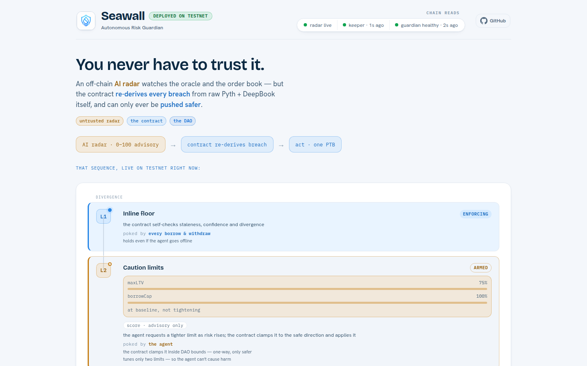

<p align="center"></p>

<h1 align="center">Seawall — Autonomous Risk Guardian for Sui lending</h1>

<p align="center">
  A trust-minimized circuit breaker for Sui lending. An off-chain AI radar watches the
  oracle and the order book; the contract re-checks every alarm against its own on-chain
  data and will only ever make the protocol <em>safer</em>.
</p>

<p align="center">
  <a href="https://seawall.dev"><b>▶ Live dashboard — seawall.dev</b></a> ·
  <a href="docs/connect-your-protocol.md">Connect your protocol</a> ·
  <a href="architecture.md">Architecture (plain English)</a>
</p>

<p align="center"><sub><b>Sui Overflow 2026</b> — Agentic Web / Sub-track 1 (Autonomous Risk Guardian) · deployed on Sui testnet</sub></p>

---

## ▶ Start at the dashboard — it _is_ the project

> **[seawall.dev](https://seawall.dev) is where Seawall actually lives.** It presents the whole
> system end to end, in one scroll — and it's where most of the build effort went: a live risk
> gauge with the model's internals exposed, the three-layer enforcement ladder updating in real
> time, the on-chain action log, a recorded freeze → unfreeze cycle, the DAO override console, and
> an attack panel that shows a malicious agent being refused. This README is the map. **The site is
> the territory — open it first.**

<p align="center"><a href="https://seawall.dev"></a></p>

What you can see live on the page right now:

- **The risk gauge with its model laid open** — the EWMA baseline, the current Mahalanobis distance against its χ² trip line, and a per-feature contribution breakdown. A glass box, not a black box.
- **The three-layer ladder, live** — L1 inline floor *enforcing*, L2 caution limits *armed*, L3 freeze, each reflecting the real on-chain state.
- **The on-chain action log** — polled straight from `queryEvents`, every clamp / freeze / relax the contract emitted.
- **The DAO override console** — the owned cap that unfreezes and re-anchors the corridor.
- **An attack panel** — drive a compromised agent and watch the contract refuse it every time.

The rest of this document explains what's behind that page.

---

## What it's for

**Seawall exists to make DeFi lending safer** — by attacking the failure mode that has cost the most.

DeFi lending breaks in a recognizable way: a price feed and the live market start disagreeing, and the protocol keeps lending, liquidating, and pricing collateral on the wrong number until someone notices.

When **Aave mis-liquidated wstETH positions**, the last line of defense was a *trusted* off-chain agent watching the price. It failed, and millions were lost on a number no one re-checked.

That is the exact category Seawall is built for — **oracle and price anomalies on a lending protocol** — and its one design rule comes straight from that failure: the off-chain watcher cannot be the thing you trust. So in Seawall, it isn't.

---

## Architecture at a glance

The whole trust story in one picture: an **untrusted** off-chain agent on the left, the **on-chain contract as the trust root** in the middle, and the **DAO** holding the only key that can ever loosen anything on the right.

<p align="center"></p>

<p align="center"><sub><em>Rendered straight from the dashboard's own diagram — the same one on <a href="https://seawall.dev">seawall.dev</a>.</em></sub></p>

The two faint arcs along the bottom are the point of the whole design: the feeds flow into the agent **and** straight into the chain. The contract reads raw Pyth and the raw DeepBook book **itself** and re-derives the breach — it never takes the agent's word.

> The plain-English version of this diagram, in full prose, is **[`architecture.md`](architecture.md)** — how the pieces fit, and why.

---

## How it's trust-minimized — concretely

The agent is an **untrusted early-warning radar**, not an authority. Everything that can cause harm is decided on-chain, by the contract, on data it reads itself. Here is what happens when the agent misbehaves:

| The agent tries to… | What the contract does | Enforced by |
|---|---|---|
| feed a fake *calm* score to mask a real breach | Ignores it — the 0–100 score never touches the logic path. The contract re-derives divergence from raw Pyth + DeepBook it reads itself. | `RiskEvaluated` carries the score as an **event field only** |
| push `max_ltv` / `borrow_cap` *looser* | Rejects the request on-chain; the ratchet only moves toward the floor. | `RequestRejected` (no tx failure — a silent refuse) |
| tighten past the DAO's floor, or send garbage | Clamps the request to `[floor, baseline]` and logs the gap. | `RequestClamped` |
| trigger **or** lift a freeze | Can't. The freeze fires only on the contract's **own** measured divergence ≥ `T`; unfreeze needs the owned `GovernanceCap` the agent physically cannot hold. | `Frozen` (contract-only) · `EWrongGovernanceCap` |
| go dark or crash | Nothing breaks. The inline floor still aborts risky borrows on every transaction; only the graded smoothing pauses. | L1 inline floor, agent-independent |
| slip in a stale or wrong price / pool | Aborts. The feed id and pool id are asserted on every read. | `EWrongFeed` / `EWrongPool` |

The summary, and the literal one-liner the project is built on:

> Its number is never trusted. Its effect is clamped to the safe direction within DAO-set bounds. The breach it would act on is re-derived on-chain from raw Pyth + DeepBook.

---

## Three layers of enforcement — and how they interact

One signal — the **Pyth ↔ DeepBook divergence** — drives one escalation ladder. What changes per rung is *who* is allowed to pull it.

| Layer | What it does | Who pulls it | Direction |
|---|---|---|---|
| **L1 · Inline floor** | Per-borrow self-check (staleness, confidence, divergence) on every `borrow` / `withdraw_collateral`. The always-on loss-preventer; works even if the agent is dead. | the contract, on every tx | abort, fail-**closed** |
| **L2 · CAUTION** | Graded tightening of `max_ltv` and `borrow_cap` as risk climbs — the AI's domain. The contract still approves or declines it: `tighter_of(clamp(agent_request), contract_own_target)`. Clamp-and-log, **never abort**. | the agent **originates**; the contract clamps | only toward the floor |
| **L3 · FREEZE** | Full market pause on the contract's **own** divergence reading ≥ `T` (5%) or an unusable book. The agent has no freeze input. | the contract, alone | halt; unfreeze is DAO-only |

**The invariant across all three:** the agent can only ever move the system *safer*, within DAO-set bounds. It cannot cause loss, loosen, or unfreeze. Only the DAO moves toward riskier.

### Relaxing — and why it leaves room for a human

Tightening is instant. **Loosening is deliberately slow, and it is the contract's own job — never the agent's.** After the market goes quiet, the contract walks each limit back toward baseline one drip at a time: **≈10% of the corridor's span every 10 minutes**, and only while *its own* fresh reading stays clear (a missing agent never causes loosening — that would fail-open). A fully-tightened limit takes about **ten steps (~100 minutes)** to reopen.

That slow walk-back is also a **window for the DAO.** Because reopening is gradual and emitted as events, a DAO watching the chain has time to step in before the corridor is fully wide again — instantly re-clamp with `governance_set_corridor`, rotate the agent, or (after a freeze) gate the unfreeze entirely. Automatic where it's safe to be automatic; human where it matters.

---

## The data and the model

The agent reads **6 keyless feeds** every ~60 s, distills them into **5 features** across two risk lanes, fuses them in **one shared covariance model**, and emits **two clamped lending limits** plus an advisory score.

<p align="center"></p>

<p align="center"><sub><em>Also rendered live on the dashboard, with the parameters ticking in real time.</em></sub></p>

**The feeds:** Pyth SUI/USD (hermes-beta) · DeepBook on-chain mid (SUI_DBUSDC) · Coinbase, OKX, Bybit SUI spot · BTC (market-context proxy).

**The features and the two knobs they drive:**

- **Solvency lane → `max_ltv`** — "can we trust the price?" `div` (oracle↔book gap) and `divvel` (how fast it's widening). A stablecoin de-peg is *mispriced, not crashing*, so only this knob moves.
- **Liquidity lane → `borrow_cap`** — "how violent and fragmented is this?" `disp` (cross-venue spread), `volvel` (the asset's realized-vol velocity), and `mktvol` (the broader market's). A violent crash tightens both.

**The estimator** is the squared **Mahalanobis distance** over an **EWMA-adaptive covariance** (mean λ = 0.99, covariance λ = 0.996 ≈ 2.9 h half-life, 0.15 shrinkage + ridge), mapped to 0–100 by the chi-squared tail with a calm dead-zone — so a genuinely calm market reads **~0 by construction**, with a closed-form per-feature contribution you can inspect rather than trust. It fires on the *joint* anomaly: when features that normally move together come apart, even with no single number out of bounds.

**We name the prior art honestly.** Mahalanobis-of-returns is the **Kritzman–Li Financial Turbulence Index**; the EWMA covariance is **RiskMetrics**. What's new is the *application* — oracle↔CLOB↔CEX divergence as a real-time breaker — and the *trust-minimized on-chain enforcement*, not the estimator. An **LLM writes the human-readable rationale only**; it is never on the decision path.

> Full derivation, every constant, and the glass-box scoring in **[`docs/ml-methodology.md`](docs/ml-methodology.md)**.

---

## Does it actually catch crashes?

We replayed **five real crashes** minute by minute on free, keyless data:

| Event | Class | What the model did |
|---|---|---|
| Oct 2025 SUI cascade | fast | contract FREEZE, coincident — too fast for any lead |
| Mar 2023 USDC de-peg | slow / solvency | the two-knob proof: only `max_ltv` moved (mispriced, not violent) |
| Feb 2025 tariff selloff | slow / solvency-onset | confirmed alarm **~5.3 h** ahead; `max_ltv` floors first |
| Aug 2024 yen-carry unwind | fast / liquidity | `borrow_cap` floors, `max_ltv` barely moves |
| May 2025 Cetus exploit | out-of-scope | incidental catch; stated honestly as not the oracle class |

**It caught all five and routed each to the right knob.** The two slow-drift events tripped the confirmed alarm *hours* ahead; the three fast crashes were caught coincident — a near-vertical move gives no head start, and we don't pretend otherwise. Calm windows stayed quiet at the **~1% false-alarm rate** the model was built for.

**One substitution, stated up front.** Live, divergence is Pyth oracle vs DeepBook CLOB mid, re-derived on-chain. Historical on-chain order-book data is archived nowhere, so the replays feed the *same detector* the closest free analog: Binance perp **last vs index** (the crypto crashes), or spot **vs the $1 peg** (USDC). Same estimator, same kind of price-vs-reference gap — not the live oracle↔CLOB signal itself. The other honest limits (early-warning rests on n = 2 in-sample slow events; depth features are live-only) are in the doc.

> Full results, every caveat, and the reproduce command in **[`docs/ml-backtest.md`](docs/ml-backtest.md)**.

---

## DAO override + the freeze cycle (real transactions)

Human override is a `&GovernanceCap` — a **separate owned object** in the DAO's wallet, passed by reference as the 2nd argument of every governance call. The agent physically cannot hold it, and a call into the shared policy can't bypass it.

```move
governance_unfreeze(policy, &GovernanceCap, clock)                                    // the only way out of a freeze
governance_set_corridor(policy, &GovernanceCap, ltv_floor, ltv_base, cap_floor, cap_base, clock)  // re-anchor the bounds
governance_rotate_agent(policy, &GovernanceCap, new_agent, clock)                     // swap the off-chain model
```

**These are not slideware.** Every call below is a real, recorded testnet transaction — click any digest.

The full **freeze → abort → unfreeze cycle** (recorded 2026-06-17):

| # | Step | Call | Result | Transaction |
|---|---|---|---|---|
| 1 | Normal operation | `demo_vault::borrow` | ✅ allowed — divergence well under threshold | [`3XjubYV…d38q`](https://suiscan.xyz/testnet/tx/3XjubYVJcE7DQZUsJRK9kCWrWTuMCfYeBRcdKmxRd38q) |
| 2 | Contract-only **freeze** | `guardian::poke` → `Frozen` (cause 0 = div ≥ T) | ✅ market halted on the contract's *own* reading | [`fRdB2pP…2wx`](https://suiscan.xyz/testnet/tx/fRdB2pPMoaCHa3oE3LdURaci2DDv2164AjJJgMiD2wx) |
| 3 | Inline floor **aborts** | `demo_vault::borrow` (identical amount) | ⛔ aborts on-chain — `EFrozen` (abort code 2) | [`6h7m6Po…eaeL`](https://suiscan.xyz/testnet/tx/6h7m6PoAL6CuYxuU4Cjcbkib6nLc8mmbWzktieegeaeL) |
| 4 | DAO **unfreeze** | `guardian::governance_unfreeze` | ✅ cleared by the owned cap — the only authority that can | [`2VdAijh…UZHu`](https://suiscan.xyz/testnet/tx/2VdAijh92nS96DGtB3LfPRJpVTBe2LrLAfstxUFYUZHu) |

The two corridor / agent governance calls (run on a separate test policy so the live demo stays put):

| Call | What it did | Transaction |
|---|---|---|
| `governance_set_corridor` | re-anchored the corridor — max-LTV 75→70%, borrow-cap 100→90% | [`CbWHFYU…b911`](https://suiscan.xyz/testnet/tx/CbWHFYUZYahUFmCgDHwC2av6sQ4EsV8wjcMEw6BNb911) |
| `governance_rotate_agent` | swapped the address allowed to submit requests | [`5nGj3nF…BHiZ`](https://suiscan.xyz/testnet/tx/5nGj3nFgd4E5wZjrVvDTa416FyF7tUnXqQ5cDhspBHiZ) |

> **Honest demo note.** That freeze fired because the demo policy uses a deliberately tight threshold (`T = 0.02%`) so testnet's natural ~0.34% oracle↔book offset trips it on cue. **Production uses `T = 5%`** — the book would have to genuinely de-peg. The freeze code and on-chain re-derivation are identical; only the per-policy, DAO-set threshold differs.

---

## Why Sui

- **PTB atomicity** — post the fresh Pyth update, re-derive the breach, and act in *one* transaction. No relay window, no glue, no trust gap between sensing and acting.
- **Move capabilities / ownership** — the agent *physically* cannot hold the unfreeze cap; "only push safer" is enforced at the type level, not by convention.
- **DeepBook** — a native on-chain CLOB the contract reads itself as the divergence reference. The breach isn't *reported* to the contract; the contract *sees* it.
- **Composability** — one published package, many independent per-protocol policy objects. Adoption is a protocol deploying its own instance and granting a scoped cap.

---

## Deployed on Sui testnet

| | id |
|---|---|
| **live dashboard** | <https://seawall.dev> |
| **package** | [`0x2635919faff8a149b59389bec81fb059a2461b6b94c27fab3ac66581bde653ad`](https://suiscan.xyz/testnet/object/0x2635919faff8a149b59389bec81fb059a2461b6b94c27fab3ac66581bde653ad) |
| `GuardianPolicy` (shared) | [`0xd6497edc…640a44b6`](https://suiscan.xyz/testnet/object/0xd6497edc5a130bb32c57d92b447f7a83588ca83df51ce8fde0ecf549640a44b6) |
| `GovernanceCap` (owned) | [`0x9a72b115…add388e41`](https://suiscan.xyz/testnet/object/0x9a72b115e1c10ae48af10395fca7007eae1369f9a1c5e6527841bf7add388e41) |
| `DemoVault` (consumer) | [`0xf9b3b69e…eadc4a79d`](https://suiscan.xyz/testnet/object/0xf9b3b69e3fd7f6b85533cfb2464aac3837a4c33d1f2cbf59b9f8539eadc4a79d) |
| Pyth SUI/USD feed id | `0x50c67b3fd225db8912a424dd4baed60ffdde625ed2feaaf283724f9608fea266` (the divergence reference) |
| publish tx | [`BAHJ5CCctZqpcgquujkXmCWZB4X2SPnDaiTgZUifTWWA`](https://suiscan.xyz/testnet/tx/BAHJ5CCctZqpcgquujkXmCWZB4X2SPnDaiTgZUifTWWA) |

All ids live in [`config/testnet.json`](config/testnet.json) — the single source the agent, keeper, and dashboard all read. The frozen contract ABI is in [`docs/ABI.md`](docs/ABI.md).

### What's in the repo

| Piece | What it does |
|---|---|
| `guardian` Move package | `GuardianPolicy` (shared) re-derives the Pyth↔DeepBook divergence on-chain and runs the 3-layer enforcement; `GovernanceCap` (owned) = DAO override |
| `demo_vault` Move module | the demo consumer — a live Pyth-priced SUI position whose inline floor calls the same params-less `poke` on every `borrow` / `withdraw_collateral` |
| `@seawall/agent` | the off-chain EWMA-Mahalanobis detector → calibrated score + `ParamRequest`; one same-PTB `submit` when it would tighten |
| `@seawall/keeper` | permissionless params-less `poke` every 5 min (freeze / relax / liveness, fully ML-independent), from its own throwaway key |
| `@seawall/dashboard` | Vite + React: the live gauge, model internals, on-chain action log, DAO override, attack panel |

The vault is the **demo consumer, not the product**. The product is **guardian-as-a-service**: any lending or perp protocol deploys its own `GuardianPolicy`, sets its own corridor, and grants its own scoped cap.

---

## Connect your protocol

Adoption is per-protocol and needs nothing from us. You deploy your own policy against the already-published package, add a **five-line gate** to every borrow path, then choose how far you go:

- **PUSH** — grant a scoped cap and let the guardian tighten your limits in-block.
- **PULL** — read its signal (`is_paused` + the two `*_current_bps`) and enforce it yourself.

> The complete, ordered, copy-paste self-deploy guide — all six steps, both modes, every real command and ABI, including running your own agent and keeper — is in **[`docs/connect-your-protocol.md`](docs/connect-your-protocol.md)**, and as a live interactive band on the [dashboard](https://seawall.dev).

---

## Documentation

| Doc | What's in it |
|---|---|
| **[`architecture.md`](architecture.md)** | **the full plain-English walkthrough** of the design — entities, roles, on-chain logic, safety bounds, relax logic ([Russian](Architecture_ru.md)) |
| [`docs/connect-your-protocol.md`](docs/connect-your-protocol.md) | the 6-step self-deploy guide (PUSH / PULL) |
| [`docs/ml-methodology.md`](docs/ml-methodology.md) | the model: features, estimator, calibration, glass-box scoring |
| [`docs/ml-backtest.md`](docs/ml-backtest.md) | the five replayed crashes, results, every caveat, reproduce command |
| [`docs/ABI.md`](docs/ABI.md) | the frozen on-chain ABI |
| [`docs/TOOLCHAIN.md`](docs/TOOLCHAIN.md) | toolchain + the two deploy-day dependency gotchas |
| [`docs/BUILD_PLAN.md`](docs/BUILD_PLAN.md) | the full build log and decisions |

---

## How it meets the ST1 must-haves

1. **Live price feed** — Pyth SUI/USD (hermes-beta), posted same-PTB into `submit` / `poke` / `borrow`.
2. **Visible AI risk score + clear criteria** — the gauge plus glass-box model internals (d² / χ² and per-feature contributions); model in [`docs/ml-methodology.md`](docs/ml-methodology.md), measured criteria + backtests in [`docs/ml-backtest.md`](docs/ml-backtest.md).
3. **≥1 autonomous on-chain action via a Move policy object** — the agent's `submit` *originates* a CAUTION tighten on `GuardianPolicy`, no human in the loop; the contract-only freeze is the second.
4. **Human override** — `governance_unfreeze` through the owned `&GovernanceCap`, DAO-only.

---

## Where it sits

This is **not** "Sui has no circuit breakers." It does — Scallop runs outflow rate-limits, NAVI does stateless lowest-of-N price *selection*. The gap Seawall fills is narrower and real: it's the only **stateful Pyth↔CLOB-divergence anomaly trigger that is trust-minimized and external**, sitting between NAVI's stateless per-op check and today's manual, hours-late freezes.

Gauntlet and Chaos Labs Edge share the metric taxonomy and the goal (capital-efficiency vs risk), and they're proof the category is real — but they are *trusted* off-chain providers; a protocol takes their number on faith. Seawall is trust-minimized: the contract re-derives the breach and the ratchet bounds the agent. Same taxonomy, enforced in-block without the trust.

## Honest scope

Seawall covers the **oracle / price-anomaly class** only. It does not catch key or governance compromise, contract logic bugs, or credit quality — and we say so rather than imply a guardian that catches everything.

---

## Run it

```bash
pnpm install
pnpm test                         # 181 TS tests
pnpm move:test                    # 75 Move tests
pnpm move:build

# verify the deployed contract end-to-end (devInspect + a few real txs, testnet):
pnpm --filter @seawall/agent  exec tsx scripts/deploy.ts        # create policy+vault, GATE 2/2b/3/3b
pnpm --filter @seawall/agent  exec tsx scripts/submit-smoke.ts  # GATE 4: autonomous submit + clamp
pnpm --filter @seawall/agent  exec tsx scripts/loop-smoke.ts    # GATE 5: warmup + elevate→tighten
pnpm --filter @seawall/keeper exec tsx scripts/keeper-smoke.ts  # GATE 6: permissionless poke

# run the live system:
pnpm --filter @seawall/agent     dev    # ML agent + control server (:8787, SSE + scenes)
pnpm --filter @seawall/keeper    dev    # 5-min keeper
pnpm --filter @seawall/dashboard dev    # dashboard (:5173)
```

---

## Team

<table>
  <tr>
    <td align="center" valign="top" width="50%">
      <a href="https://github.com/kartashovio"></a><br />
      <strong>Timur Kartashov</strong><br />
      <sub>Kazakhstan</sub><br />
      <sub>architecture · implementation · tests</sub><br />
      <a href="https://github.com/kartashovio">GitHub</a> ·
      <a href="https://x.com/kartashovio">X</a> ·
      <a href="mailto:tkartashov.io@gmail.com">email</a> ·
      <a href="https://www.deepsurge.xyz/profiles/bfef510f-dac2-44d2-96fb-5458ea718e99">DeepSurge</a>
    </td>
    <td align="center" valign="top" width="50%">
      <a href="https://www.deepsurge.xyz/profiles/cca743e4-2322-4632-bfd9-ff0e67563a98"></a><br />
      <strong>Birzhan Iglik</strong><br />
      <sub>VIP Kazakh</sub><br />
      <sub>architecture · tests · ML-engineer</sub><br />
      <a href="https://www.deepsurge.xyz/profiles/cca743e4-2322-4632-bfd9-ff0e67563a98">DeepSurge</a>
    </td>
  </tr>
</table>
